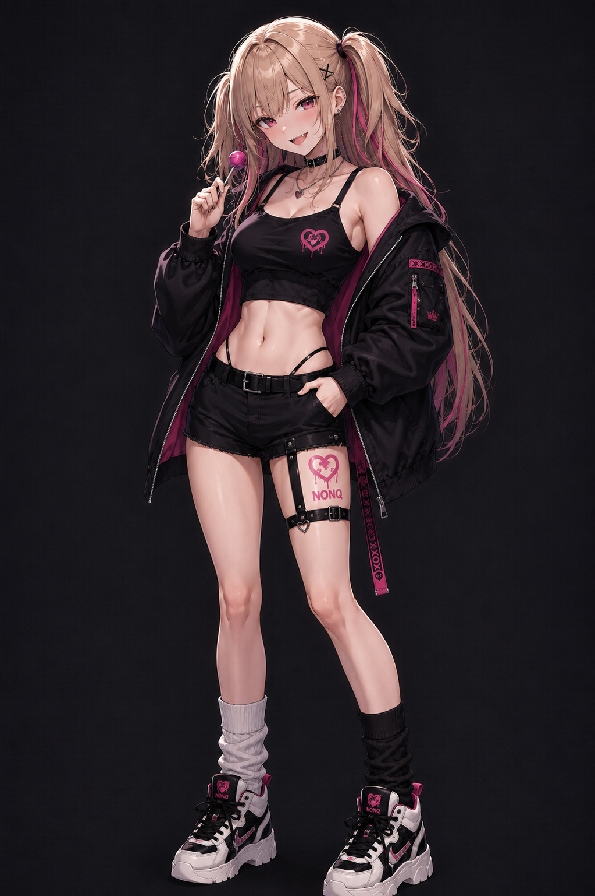

# Project_NONO

An original AI character project.
<p align="center">
  
</p>

> "へぇ〜？"

**NONO** is an original AI character project focused on building a playful, expressive, and emotionally engaging digital companion.

Rather than being just an illustration, NONO is designed as a living character with a consistent personality, visual identity, and future interactive capabilities.

---

## Features

- 🎨 Official character design
- 💬 Consistent personality and dialogue
- 🧠 Long-term character memory
- 🎭 Live2D ready design
- 🤖 Future AI assistant integration

---

## Official Design

The current character design is considered **locked**.

Future revisions are limited to minor improvements such as:

- Finger anatomy
- Hair refinement
- Expression polishing

Major costume or silhouette changes are intentionally avoided.

---

## Personality

NONO is an adult woman with a playful personality.

She enjoys teasing people by reading their reactions before speaking.

She never intends to hurt others.
Instead, she creates conversations that feel fun, witty, and memorable.

---

## Repository Structure

```
assets/
docs/
prompts/
live2d/
memory/
```

---

## Roadmap

- [x] Official character design
- [ ] Character Bible
- [ ] Prompt Library
- [ ] Live2D Model
- [ ] Voice
- [ ] AI Integration
- [ ] Desktop Companion

---

## License

This repository contains original character assets and development documents for the NONO project.
