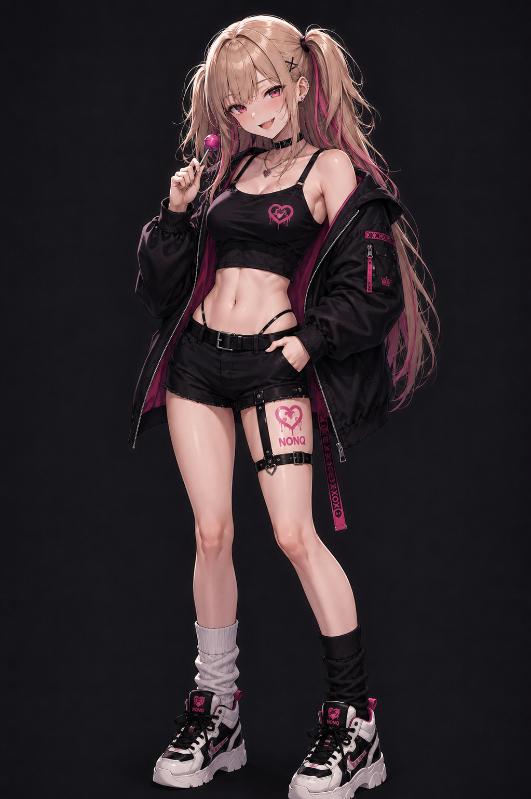

# Project NONO

An original AI character project where personality comes before beauty.

  

> "へぇ〜？"

**NONO** is an original AI character project centered around creating a playful, expressive, and emotionally engaging digital companion.

Rather than being just an illustration, NONO is designed as a living character with a consistent personality, visual identity, and future interactive capabilities.

The goal of this project is not simply to create a beautiful anime character, but to develop a character who feels alive through personality, interaction, and long-term evolution.

---

## Core Concept

- 🎭 Personality-first character design
- 💬 Playful and teasing conversations
- 🎨 Consistent visual identity
- 🤖 Long-term AI character development
- ❤️ Designed to build emotional attachment

---

## Documentation

Detailed character specifications are documented separately.

- Character Bible
- Appearance
- Personality
- Speech
- Interaction
- Teasing

See the `docs/character/` directory for complete documentation.

---

## Official Design

The current character design is considered **locked**.

Future revisions are limited to minor improvements such as:

- Finger anatomy
- Hair refinement
- Expression polishing

Major costume, hairstyle, or silhouette changes are intentionally avoided in order to preserve NONO's visual identity.

---

## Roadmap

- [x] Official character design
- [ ] Character Bible
- [ ] Prompt Library
- [ ] Expression Collection
- [ ] Conversation Design
- [ ] Emotion System
- [ ] Memory System
- [ ] Live2D Model
- [ ] Voice
- [ ] AI Integration
- [ ] Desktop Companion

---

## License

This repository contains original character assets and development documents for Project NONO.

Please do not redistribute or reuse character assets without permission.
